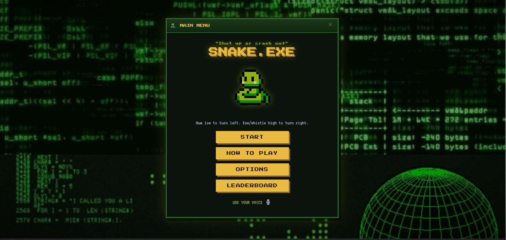
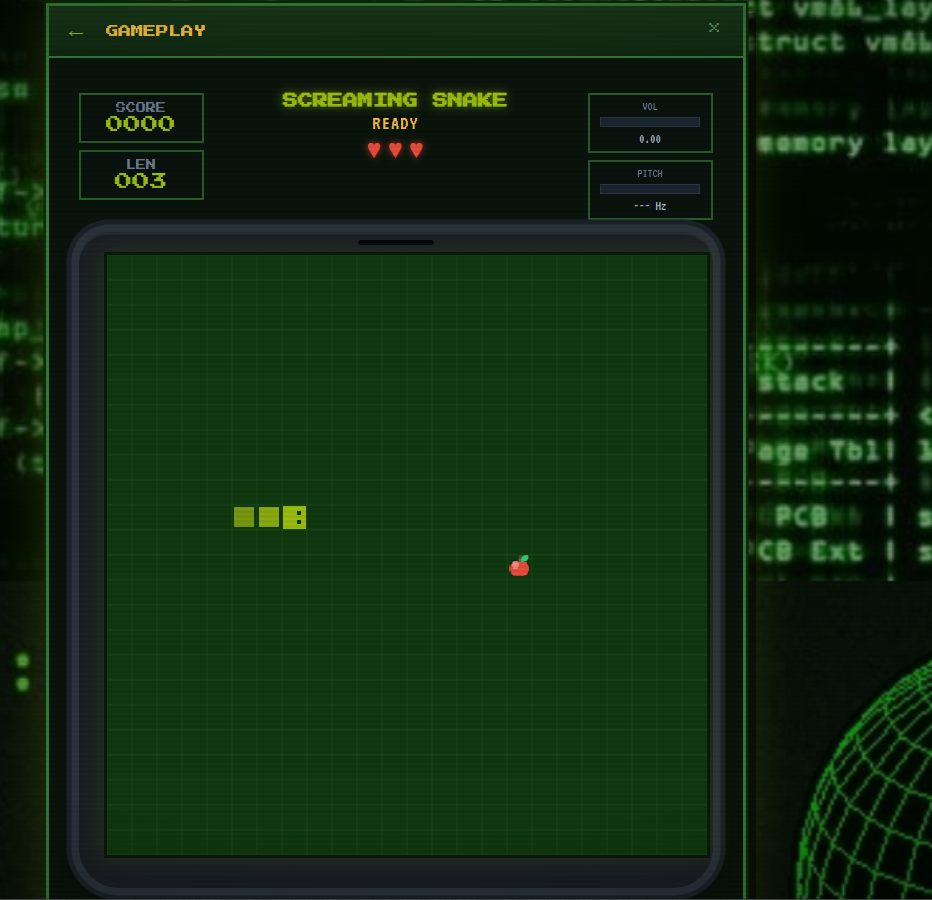
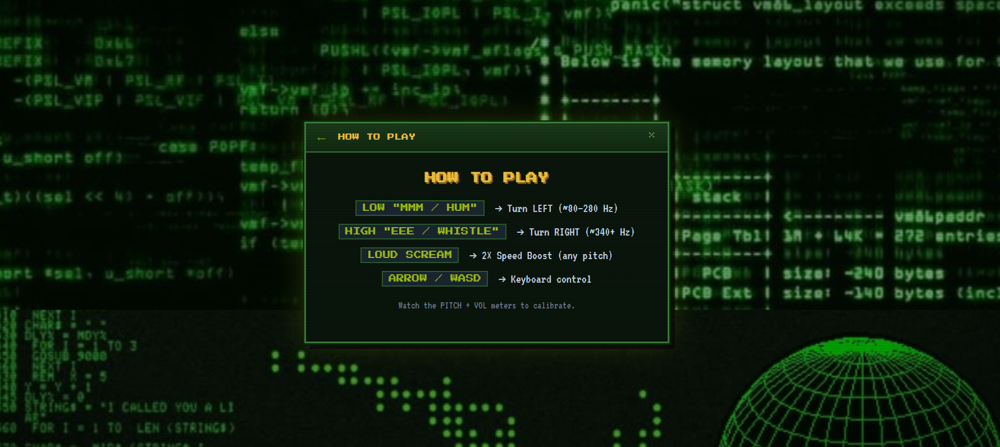
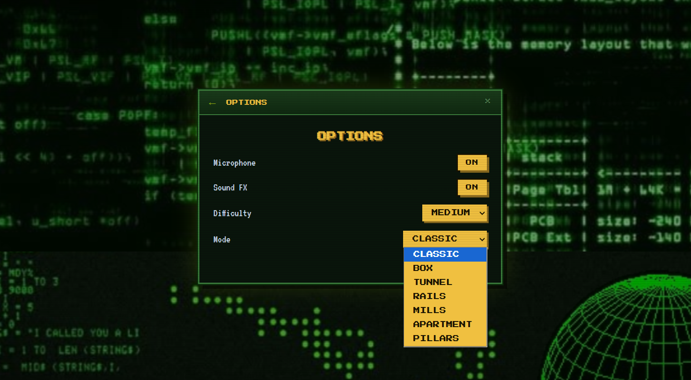
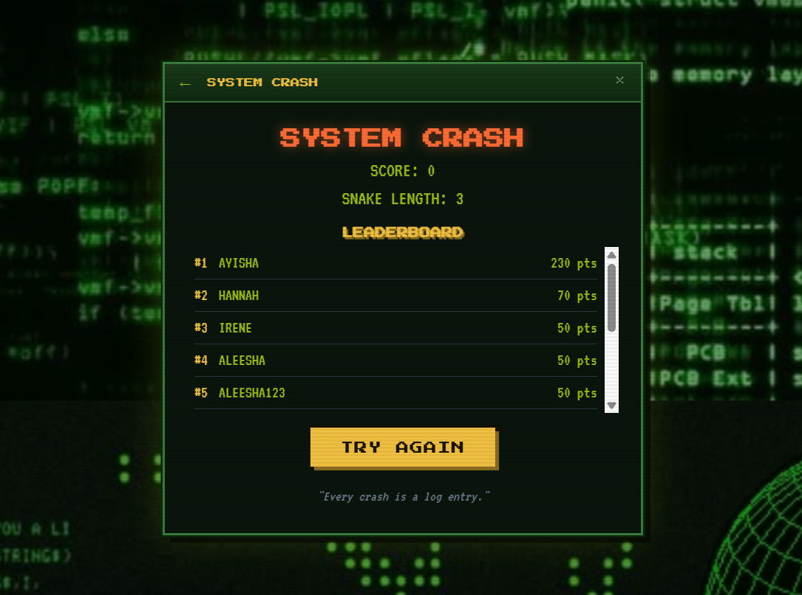
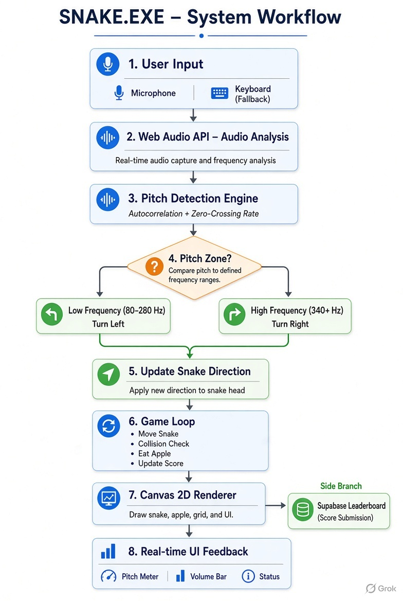

# SNAKE.EXE 🎯

## Basic Details

### Team Name: BYTE ME

### Team Members
- Team Lead: AYISHA MOHAMMED - CUSAT
- Member 2: HANNAH ACHU JOHN - CUSAT

### Project Description
SNAKE.EXE is a classic Snake game reborn as a voice-controlled chaos machine. Instead of arrow keys, you control the snake by humming low to turn left and whistling/eeeing high to turn right. Complete with CRT scanlines, pixel-art UI, live pitch meter, difficulty modes, and a global leaderboard — because the world needed one more reason to scream at a computer.

### The Problem (that doesn't exist)
People have two hands. Keyboards have too many keys. And modern life is full of quiet, polite ways to play games. This is unacceptable. We needed a game that forces you to make weird noises in public (or in a quiet library) just to survive.

### The Solution (that nobody asked for)
We built a full browser-based Snake game where the microphone is the controller. Real-time pitch detection turns your voice into left/right commands. Low “mmm/hum” = left, high “eee/whistle” = right. Keyboard is only a backup for cowards. Add a retro OS window aesthetic, glowing pitch meters, and a Supabase leaderboard so you can prove you screamed the loudest.

## Technical Details

### Technologies/Components Used

**For Software:**
- **Languages used:** HTML5, CSS3, JavaScript (Vanilla)
- **Libraries used:**
  - Web Audio API (microphone + pitch/volume analysis)
  - Supabase JS client (online leaderboard)
- **Tools used:**
  - Canvas 2D for game rendering
  - Autocorrelation + Zero-Crossing Rate for pitch detection
  - LocalStorage fallback for offline scores

**For Hardware:**  
Not applicable (pure software project)

### Implementation

**For Software:**

#### Run
```bash
# Option 1: Open directly
open index.html          # or double-click it

# Option 2: Serve locally (recommended for mic permissions)
npx serve .
# or
python -m http.server 8000
```

Then open `http://localhost:8000` and allow microphone access.

## Project Documentation

### Screenshots

  
*Main Menu of SNAKE.EXE — retro CRT aesthetic with the iconic tagline “Shut up or crash out” and the voice control hint.*

  
*Live gameplay showing the snake, the apple food, score, length, and real-time Volume + Pitch meters.*

  
*How to Play screen explaining the voice controls: Low hum = Turn Left, High whistle = Turn Right, and keyboard fallback.*

  
*Options menu where players can toggle Microphone, Sound FX, choose Difficulty, and select different game modes.*

  
*“SYSTEM CRASH” Game Over screen with final score, snake length, and the live online leaderboard powered by Supabase.*

### Diagrams

  
*Complete system workflow: Microphone → Pitch Detection → Direction Control → Game Loop → Canvas Rendering + Leaderboard submission.*

## Project Demo

### Video
https://drive.google.com/drive/folders/1eyWASZlBwcNhZ2aHh1W31N7kDWZh-wfO?usp=sharing 
*Demo showing: starting the game → allowing microphone → controlling the snake with voice (hum left / whistle right) → eating the apple → crashing → submitting score to the leaderboard.*

### Additional Demos
- Live pitch & volume meters reacting in real time
- Keyboard fallback when microphone is denied
- Multiple difficulty levels and game modes
- Online leaderboard with Supabase + localStorage fallback

## Team Contributions
- **AYISHA MOHAMMED**: Voice control system, pitch detection logic, game engine, UI design
- **HANNAH ACHU JOHN**: Leaderboard integration (Supabase), styling & CRT effects,  testing and polish

---

Made with ❤️ (and a lot of weird humming) at TinkerHub Useless Projects


